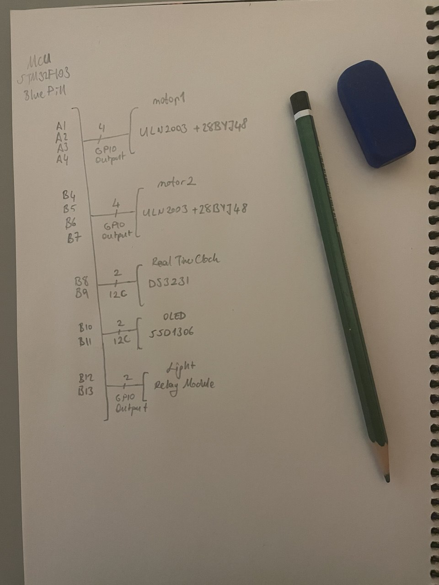

# fishei

**fishei**, bir akvaryum otomasyon projesidir. 
Balıkları besler ve bitkileri ışıklandırır.

## Özellikler

- **Gerçek Zamanlı Saat Takibi:** DS3231 modülü ile güncel zaman sürekli izlenir ve sistem, zamanlamaya göre otomatik işlem yapar.
- **Işık Kontrolü:** Akvaryum ışıkları, röle modülü aracılığıyla programlanan saatlerde açılır ve kapanır.
- **Yemleme Makinesi:** 28BYJ-48 step motor ve ULN2003 sürücüsü ile balık yemleme mekanizması hassas ve güvenilir şekilde çalışır.
- **Durum İzleme:** SSD1306 ekran sayesinde akvaryumun mevcut durumu ve zamanlayıcı bilgileri kullanıcıya görsel olarak sunulur.
- **Bare-Metal Co-operative Multitasking:** Nonblocking yapılar kullanılarak düşük seviye, verimli ve stabil bir kontrol mimarisi sağlanmıştır.

## Proje Bağlantı Şeması
